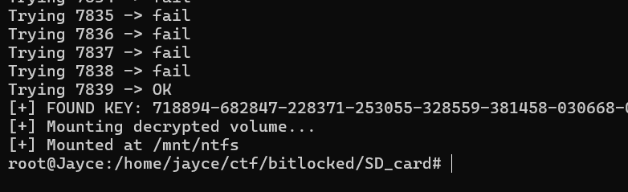

### WhyCTF2025 - Bitlocker

- I found this old encrypted SD-Card, but I forgot the password. Luckily I always make a photo to know which recovery key belongs to which device. Can you check what is on the disk?

    


- File analys
    ```sh
    jayce@Jayce:~/ctf/bitlocked/SD_card$ file SD_card.001
    SD_card.001: DOS/MBR boot sector; partition 1 : ID=0xc, start-CHS (0x0,130,3), end-CHS (0x1e8,254,63), startsector 8192, 7854080 sectors, extended partition table (last)
    ```

    → Bitlocker file with the key in img, we know a path of recovery key: 
    
    `718894-682847-228371-253055-328559-381458-030668-0XXXXX`
    
    

    - Bitlocker has `48bits (6bits, 8 blocks)`, we have 7 blocks and 1 bit clearly. By my judgment, I guess the 2nd bit of the last block is `number 4`

    

    - So, the recovery key is:
    `718894-682847-228371-253055-328559-381458-030668-04XXXX`


- Brute the key, i using `dislocker` tool

    - First, check the mount

    ```sh
    jayce@Jayce:~/ctf/bitlocked/SD_card$ sudo losetup --partscan --find --show SD_card.001
    /dev/loop0
    jayce@Jayce:~/ctf/bitlocked/SD_card$ lsblk /dev/loop0
    NAME      MAJ:MIN RM  SIZE RO TYPE MOUNTPOINTS
    loop0       7:0    0  3.7G  0 loop
    └─loop0p1 259:0    0  3.7G  0 part
    ```

    - Make the directory for it

    ```sh
    sudo mkdir -p /mnt/dislocker /mnt/ntfs
    sudo dislocker -V /dev/loop0p1 -r -p"718894-682847-228371-253055-328559-381458-030668-04XXXX" -- /mnt/dislocker
    ```

    → Script for recovery the last 4 bit of key


    ```python3
    import subprocess
    import os
    import sys

    IMAGE_PART = "/dev/loop0p1"
    KNOWN_PREFIX = "718894-682847-228371-253055-328559-381458-030668-04"
    DISLOCKER_MNT = "/mnt/dislocker"
    NTFS_MNT = "/mnt/ntfs"

    os.makedirs(DISLOCKER_MNT, exist_ok=True)
    os.makedirs(NTFS_MNT, exist_ok=True)

    def try_key(suffix):
        key = KNOWN_PREFIX + suffix
        df = os.path.join(DISLOCKER_MNT, "dislocker-file")
        if os.path.exists(df):
            os.remove(df)
        cmd = ["dislocker", "-V", IMAGE_PART, "-r", "-p" + key, "--", DISLOCKER_MNT]
        p = subprocess.run(cmd, stdout=subprocess.PIPE, stderr=subprocess.PIPE)
        if p.returncode == 0 and os.path.exists(df):
            return True, key
        return False, None

    for i in range(0, 10000):
        suffix = f"{i:04d}"
        ok, found_key = try_key(suffix)
        print(f"Trying {suffix} -> {'OK' if ok else 'fail'}", flush=True)
        if ok:
            print("[+] FOUND KEY:", found_key)
            print("[+] Mounting decrypted volume...")
            subprocess.run(["mount", "-o", "loop", os.path.join(DISLOCKER_MNT, "dislocker-file"), NTFS_MNT])
            print("[+] Mounted at", NTFS_MNT)
            sys.exit(0)

    print("[-] Key not found")
    ```
    
- Using root & run script, i found the full key is: `718894-682847-228371-253055-328559-381458-030668-047839`

    

    - Getting the flag: `flag{874ce13969267c0124118c0d7b25c8cc}`

    