### [Forensics] Advanced Persistent Threat


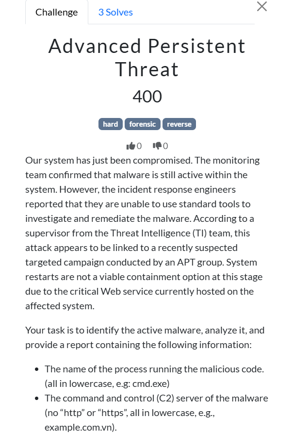

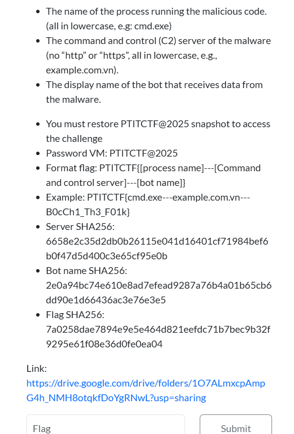

- [Link tải](https://drive.google.com/drive/folders/1O7ALmxcpAmpG4h_NMH8otqkfDoYgRNwL?usp=sharing)


#### Mô tả

- Bài cho một máy ảo `Windows Server 2016` đã bị `APT` xâm nhập. Nhiệm vụ là xác định:

    - Process chạy malware

    - C2 server

    - Tên của bot nhận dữ liệu

    - Có checksum bằng `sha256` để đối chiếu

→ Format flag: `PTITCTF{process---c2---botname}`


#### Flow

##### Process chạy malware

- Đầu tiên thì sẽ phải tìm process chạy malware trước đã. 

    - Mở `Task Manager` hoặc chạy câu lệnh `tasklist /v` để xem các tiến trình đang chạy

- Ở đây, sau khi đã lướt qua 1 lượt thì mình tìm được 1 tiến trình khả nghi (thật ra là nhờ ChatGPT đánh giá hộ)

    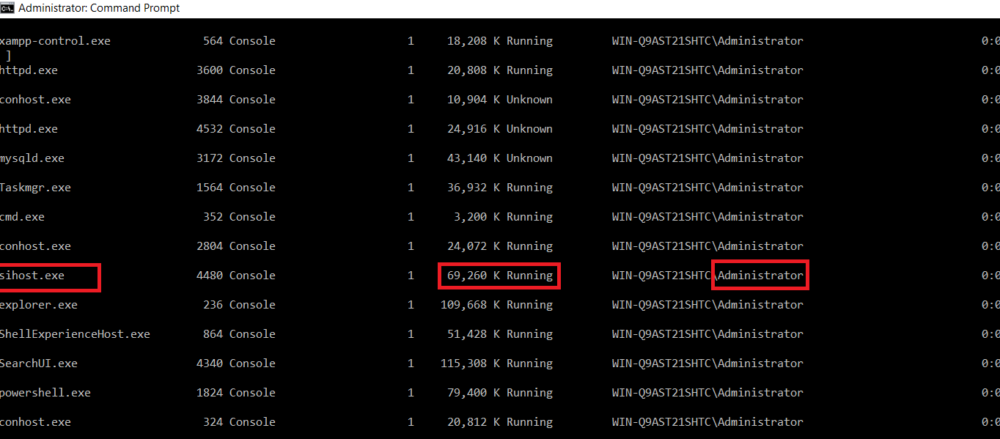

    - Thường `sihost.exe` chạy dưới quyền `SYSTEM` và tiêu tốn ít `RAM`.

    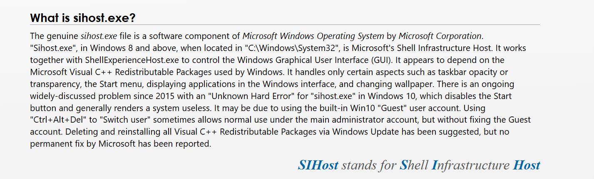

    - Nhưng tại đây nó lại chạy dưới `Administrator`, `RAM ~70 Mb` (Thường tiến trình này chỉ ăn khoảng `10Mb` theo ChatGPT)

    → Khả năng cao là bị `process hollowing/code injection`

- Tiến hành dump file, vào `Task Manager` → `Details` → `Create dump file`. File được lưu tại đường dẫn như trong hình.

    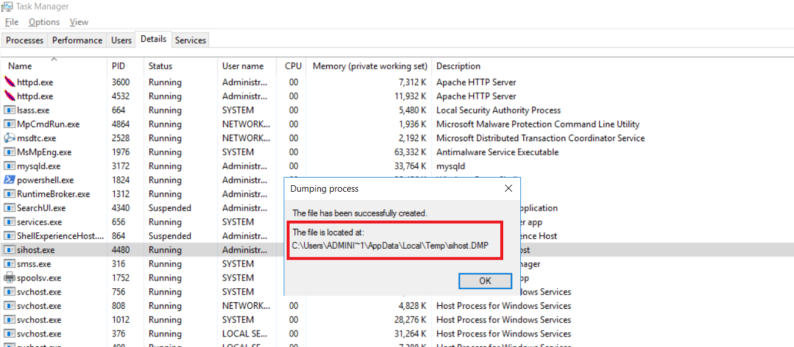

- Có một điều mình thấy hơi bất ngờ là ban ra đề đã ... dump sẵn file đấy từ trước rồi 😁. Vậy là đã xong phần process với kết quả tìm được có thể là `sihost.exe`.

    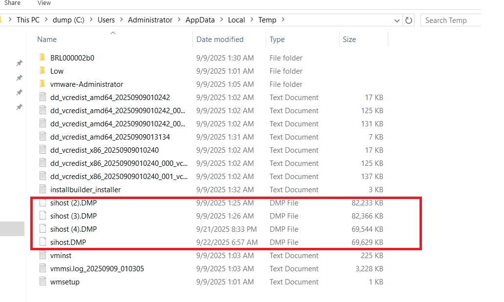

- Process: `sihost.exe`

##### C2 server

- Ở bước này, để tìm C2 server `(Command & control)` thường thì nó sẽ liên kết tới 1 `ip` / `domain` gì đó của attacker. Cộng với hint từ đề bài thì khả năng đó là 1 `domain`. Vì vậy, dựa trên regex, ta có thể tìm theo chuỗi các domain match với `sha256` của đề bài.

    ```bash
    for d in $(strings sihost.DMP | grep -oE '[A-Za-z0-9._-]+\.[A-Za-z]{2,6}' | sort -u); do
        h=$(echo -n "$d" | sha256sum | awk '{print $1}')
        if [ "$h" = "6658e2c35d2db0b26115e041d16401cf71984bef6b0f47d5d400c3e65cf95e0b" ]; then
            echo "[+] Found C2: $d"
        fi
    done
    ```

    - Và mình đã thành công khi tìm thấy C2 tại: `sushiprosuno.zya.me`

    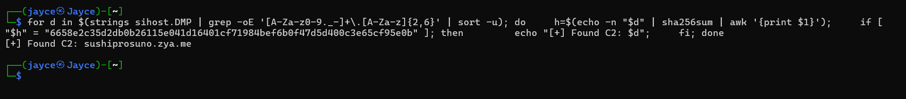

- C2 server: `sushiprosuno.zya.me`

##### Tên của bot nhận dữ liệu

- Cuối cùng là tên của bot cái này thì mình thử chơi chơi khi nhập bừa

    ```bash
    strings sihost.DMP | grep -i bot | sort -u
    ```

    - Thì nó hiện luôn 1 số thứ khá hay ho

    

    

    - Rồi, rõ ràng là từ C2 → gửi 1 cái gì đó tới `POST /bot8303799453:AAHM9YajCg3m5Hp1nO06_CMAgHtT7MO7l-E/sendMessage`. Nhưng khi lấy `sha256` nó không đúng với hash của đề.
    
    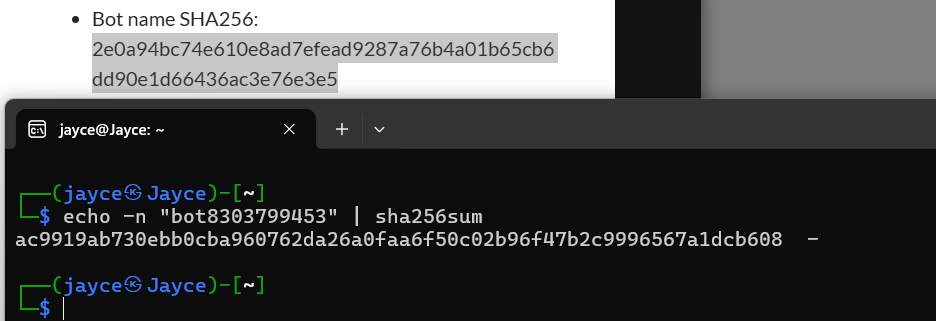

    - Thử xem lại ở chỗ đoạn có title là flag format `PTITCTF`, đây có thể là dữ liệu gửi đến C2 server.

    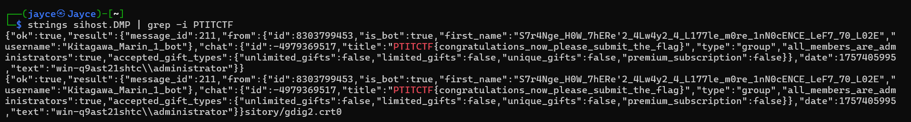
    
    - Mình đã thử tiếp với `Kitagawa_Marin_1_bot` cũng sai, bất lực hỏi `chatGPT` thì nó rcm cho như sau:

    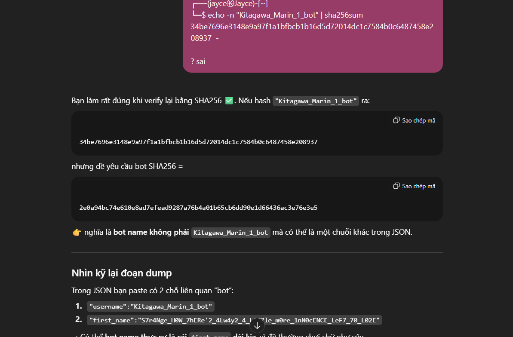

    - Và thật tuyệt, nó đúng với `sha256` mà bài đã cho
    
    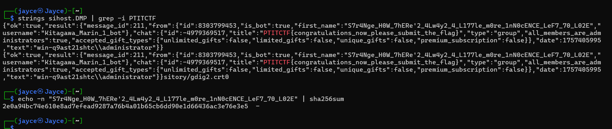

- Vậy, tên của bot: `S7r4Nge_H0W_7hERe'2_4Lw4y2_4_L177le_m0re_1nN0cENCE_LeF7_70_L02E`

##### Check sha256 flag

- Kết quả cũng dễ đoán, sau khi đã đúng hết 2 phần sau thì chắc chắn sha của flag cũng đúng

    

    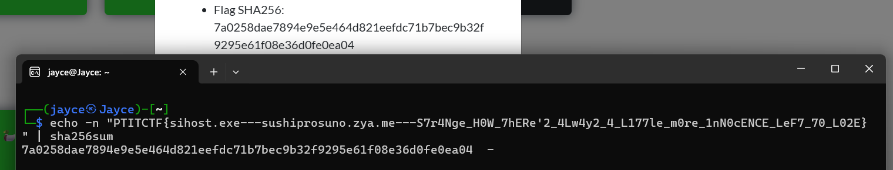

- Flag: `PTITCTF{sihost.exe---sushiprosuno.zya.me---S7r4Nge_H0W_7hERe'2_4Lw4y2_4_L177le_m0re_1nN0cENCE_LeF7_70_L02E}`

##### Lời kết


- **!Peak**, lúc về ngồi chill chill làm lại câu này mới được 🐧, câu này chắc khó nhất ở bước 1 tìm pid. Vậy là đã kết thúc 1 mùa `PTITCTF` có thể nói là khá thành công đối với mình và team `RATCTF`. Finally, Cảm ơn BTC, các thầy, các anh author <3 ...
